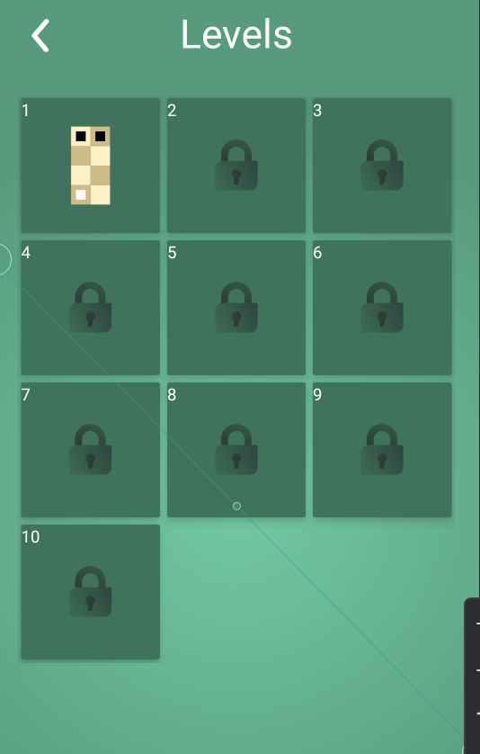
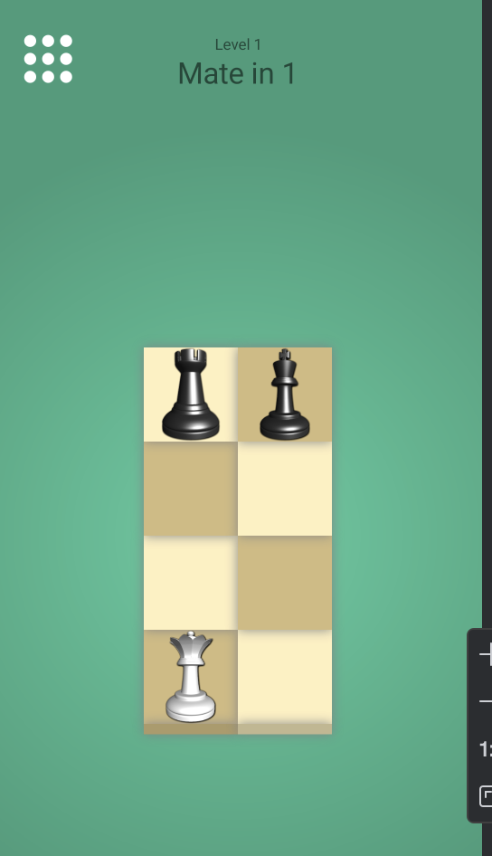

# SmartChess

## About
SmartChess is a variation of the traditional chess.  
SmartChess is an Android app offering bite-sized chess puzzles.  
Players must checkmate the king in a limited number of moves on compact boards with varying piece arrangements.  
With each level presenting a new challenge, it's a stimulating and strategic game for chess enthusiasts on the go.

## How to run the code
- Install Java and JDK 8 or later version  
- Set up your environment variables  
- Install Android Studio  
- Run the app in Android Studio  

## Features
- Progress through difficulty levels seamlessly after completing each puzzle.  
- Solve chess puzzles for checkmate  
- Interact by touching and placing chess pieces with ease.  
- Access both reset and undo options for refining puzzle-solving strategies.  
- Track progress and revisit puzzles

  
## Screenshots

